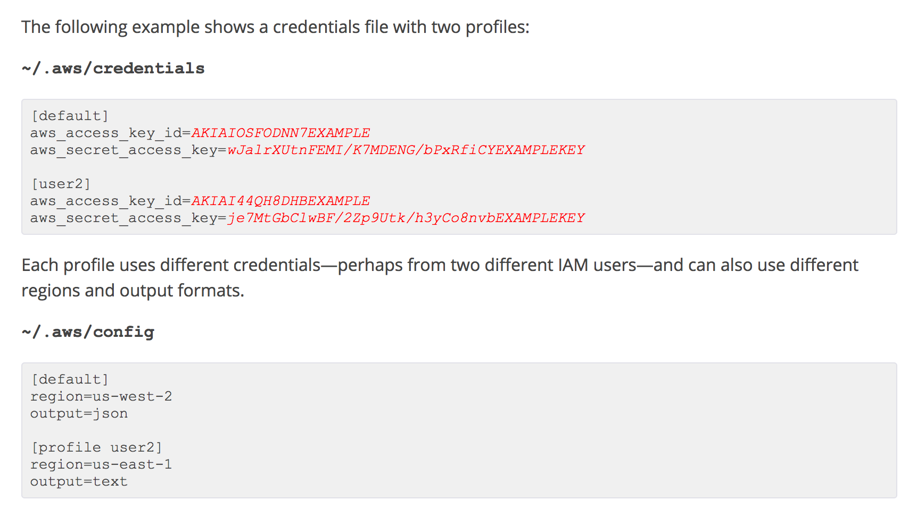

# Serverless Express Example

## Installation

### [AWS CLI Installation](http://docs.aws.amazon.com/cli/latest/userguide/installing.html)

```bash
pip install awscli --upgrade --user
aws --version
```

### [AWS Profiles](https://serverless.com/framework/docs/providers/aws/guide/credentials/)

```bash
aws configure
```



### [Typescript](https://www.typescriptlang.org/#download-links)

```bash
npm install -g typescript

# Compile the typescript files
tsc
```

### [Serverless](https://github.com/serverless/serverless) 

```bash
npm install
npm install -g serverless
```


## Usage


### Serve Serverless Locally

```bash
serverless offline start

curl http://localhost:3000/
```


### Invoke function locally

[Docs](https://serverless.com/framework/docs/providers/aws/cli-reference/invoke-local/)

```
serverless invoke local --function api
```

### Deployment

```bash
serverless deploy --stage dev --aws-profile your-aws-profile
```

### Removal

```bash
serverless remove --stage dev --aws-profile your-aws-profile
```


## Articles & Resources

[serverless.yml Reference](https://serverless.com/framework/docs/providers/aws/guide/serverless.yml/)

[Inspiration](https://medium.com/trisfera/deploying-an-express-application-to-aws-lambda-the-easy-way-fa5fbef190ba)

[Another Code Example](https://github.com/alexishevia/blogExamples/tree/serverless_express)

[Serverless Offline Plugin](https://github.com/dherault/serverless-offline)

[Express, Node, and Typescript](http://mherman.org/blog/2016/11/05/developing-a-restful-api-with-node-and-typescript/)